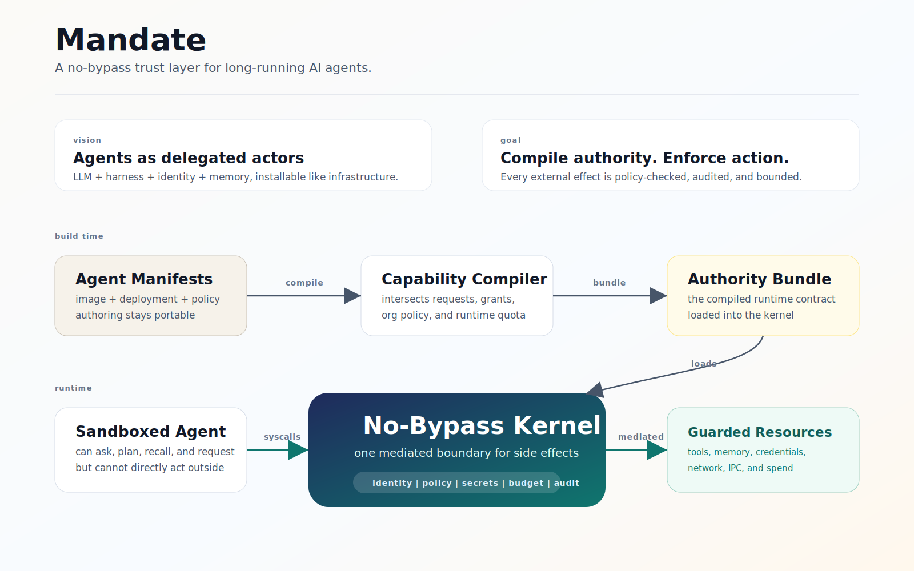

# Mandate

**A capability microkernel for AI agents.**

A *mandate* is delegated authority to act on someone's behalf — bounded, revocable,
auditable. That is exactly what an autonomous agent needs and what this project compiles
and enforces. Mandate turns author-declared agent images, private deployment grants, and
organization policy into an effective runtime **capability bundle**. Every tool call,
memory operation, credential use, IPC message, and budget charge crosses the same
**syscall boundary** and is enforced under one agent identity.

> **Status: design stage.** The kernel contract (`v0.2`) is defined and the P0 vertical
> slice is specified. Implementation has not started — see [`ROADMAP.md`](./ROADMAP.md).
> Expect the contract to change.

---

## Vision

Agents should be long-running delegated actors, not stateless chat loops. A real agent is
an LLM plus a harness, identity, and memory: it can use tools, receive messages, hold
credentials through a broker, remember across sessions, and act on behalf of a user or
organization.

Mandate makes that actor installable like infrastructure: publish an agent image, bind it
to private identity and grants at deployment time, then run it under one auditable trust
boundary.

## Goal

Build the runtime trust layer underneath agent manifests. Mandate should compile
author-declared requirements, installer grants, organization policy, and runtime quota
into one effective authority bundle, then enforce it at every side-effect boundary.

The first goal is deliberately small: prove that a prompt-injected, non-cooperative agent
cannot bypass the kernel to reach tools, memory, credentials, network egress, IPC, or
budgeted spend.

## Architecture



---

## Why

Most projects in this space define *what an agent is* — a framework: prompt + tools + a
loop. Mandate is the layer underneath: the **control plane for an agent _workload_** —
its install, identity, capabilities, secrets, memory, budget, audit, and isolation.

The wedge is **not** the YAML. Docker `cagent`, AgentSpec, and Agent Format already make
agents declarative. The wedge is that the manifest **compiles into capabilities the
kernel enforces at the syscall boundary** — and that the agent has no way to act outside
them.

```
A better manifest for agents          ← what others are building
The compiler + kernel that turn        ← what this is
manifests into enforceable capabilities
```

## The one invariant that makes it a kernel

> **No bypass.** There is no path from agent-controlled execution to an external side
> effect that does not cross a mediated syscall.

A policy engine on its own is advice an agent can route around. Mandate enforces at the
boundary: sandbox egress is deny-by-default, secrets are broker-injected (the agent never
sees plaintext), and every side-effecting path is a syscall. A prompt-injected agent can
*request* anything; it can only *act* through the kernel. This is the difference between
Mandate and a cooperative SDK wrapper, and it is what the P0 demo proves adversarially.

## How it compiles

```
agent.yaml (image)  +  agent-compose.yaml (deployment)  +  org-policy.yaml
        │                          │                            │
        └──────────────────────────┴─────────────┬──────────────┘
                                                  ▼
                                        Mandate Compiler
                                                  ▼
                              effective capability bundle  (the "binary")
                                                  ▼
                              microkernel enforces at every syscall

effective = image.constraints ⊓ deployment.grants ⊓ org.policy ⊓ runtime.quota
            (capabilities by intersection · scalar limits by min · modes by most-restrictive)
```

## The three files

| File | Kind | Who writes it | Holds |
|------|------|---------------|-------|
| [`agent.yaml`](./examples/research-assistant/agent.yaml) | `AgentImage` | author | requirements, requests, constraints, persona. **No secrets, no identity, no budgets.** Publishable & signable. |
| [`agent-compose.yaml`](./examples/research-assistant/agent-compose.yaml) | `AgentDeployment` | installer | grants, identity bindings, budget, memory volume, concrete model. **Private. Installing = granting.** |
| [`org-policy.yaml`](./examples/research-assistant/org-policy.yaml) | `OrgPolicy` | org admin | tenant-wide guardrails (deny/approval/limits). |

## What we build vs reuse

Reuse, don't reinvent: **durable execution** (Temporal / Restate) as scheduler + journal,
**sandbox** (E2B / Firecracker, gVisor) for isolation, **credential broker**
(Infisical Agent Vault) so the agent never sees secrets, **memory backend** (mem0 / Letta)
behind our permission layer.

Build (the wedge): the **manifest compiler**, the **capability runtime + syscall gateway**,
**capability-decision audit/replay**, and — later — the **identity-as-citizen wallet** and
**cross-layer fork**. Full mapping in the [contract](./docs/mandate-kernel-contract-v0.2.md#13-build-vs-buy-corrected).

## Repo structure

```
.
├── README.md
├── ROADMAP.md
├── docs/
│   └── mandate-kernel-contract-v0.2.md   # the spec / contract
├── examples/
│   └── research-assistant/               # the P0 demo agent
│       ├── agent.yaml
│       ├── agent-compose.yaml
│       └── org-policy.yaml
├── compiler/                             # (planned) manifest → capability bundle
├── kernel/                               # (planned) syscall gateway + enforcement
└── sdk/                                  # (planned) agent-facing syscall client
```

## License

Apache-2.0 (add via GitHub's license template, or `gh repo create --license apache-2.0`).
